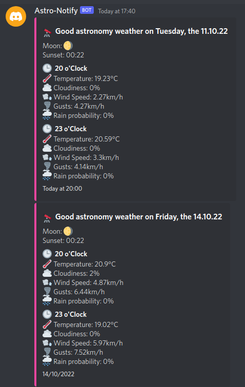

# astro-bot

A small python script that creates a discord bot, which connects to OpenWeatherMap and sends you a message if theres good weather for astronomy coming up!

## Setting up
1. Create an API-Key at https://discord.com/developers/applications and https://openweathermap.org/api
2. Edit the Python script for your specific city
3. Run the bot using `DISCORD_KEY="your discord api key" OPENWEATHER_KEY="your OpenWeather api key" python3 astro-bot.py`
4. Add the bot to your server using the discord developer portal and create a channel for it (`astro-bot` by default)

You can use the `!astro` command to get a digest on demand.